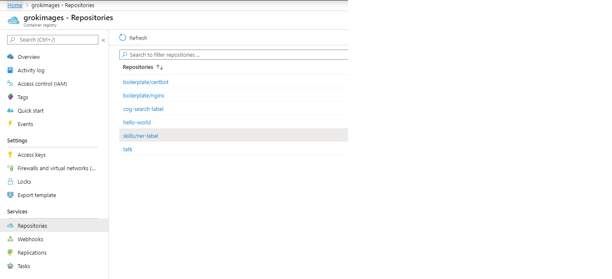
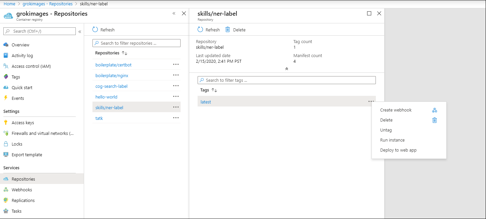
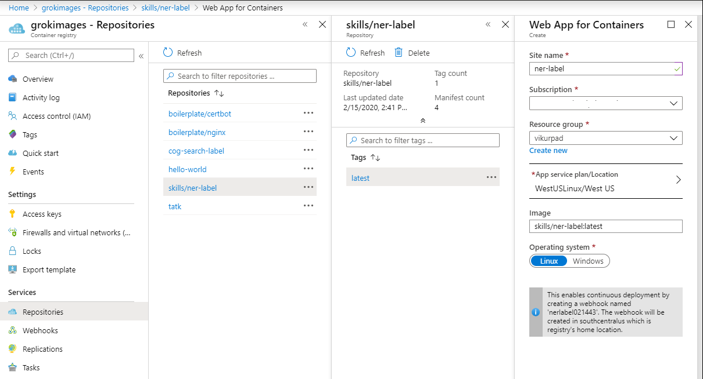

# label-skill

## Azure Cognitive Search
Custom named entity recognition is a common challenge for most scenarios in [Azure Cognitive Search](https://docs.microsoft.com/en-us/azure/search/search-what-is-azure-search). When building a named entity recognizer, one of the biggest challenges is a lack of labeled data. For organizations that know examples of entities they want to identify, the label skill takes in a list of custom entities and associated types and as an output, generates a set of POS tagged sentences with IOB labels for the entities. 

## Build and deploy
1. Clone the repo
2. Build the docker file using the docker build command from the `docker_commands` file
3. Run the container locally with the docker run command
4. Test the endpoints on port 8080
5. Create and tag the image 
6. Push the image to [Azure Container Registry](https://docs.microsoft.com/en-us/azure/container-registry/container-registry-get-started-docker-cli)
7. To deploy the container as a webapp, select the container from the Azure container Registry repository
 
8. Click on the ellipses of the tag and select the `Deploy as web app` option  
 
9. On the wep app deployment blade, fill out the required information to deploy 
 
10. Once the deploymen completes you container should be ready to test
11. Test the container by clicking on the URL of the deployed web app, you should see a message `To invoke the skill POST the custom skill request payload to the /label endpoint. To set the custom entities, POST to the /annotations endopoint. For a sample, GET the /annotations.`

## Setup and Use

1. Once you have the container deployed, send a GET request to `https://{your web app name}.azurewebsites.net/annotations`
2. Copy he JSON response, edit it to define the custom entities and types you want to label in your dataset
3. POST the edited JSON to `https://{your web app name}.azurewebsites.net/annotations` 
4. Your skill is now ready to use with a valid payload
5. Use the [Postman collection](cog_search/postman_collection) to 
    + Create a datasource
    + Create a skillset
    + Create a index
    + create a indexer

>Set the environment variables in Postman
6. Run your indexer, you should now have a [knowledge store](https://docs.microsoft.com/en-us/azure/search/knowledge-store-concept-intro) projections in tables called `sentences` and `labels`
7. The `sentences` table contains a row for each sentence in the documents
8. The labels table contains a row for each token in a sentence with the POS tag and the IOB label based on the annotaions configured.
9. You can export the table as a CSV to use in the training of a NER model

## Add the NER Skill to the skillset

1. Once the Azure ML model is trained and deployed to AKS, you can add it back to the skillset as custom skill and run the indexer again
